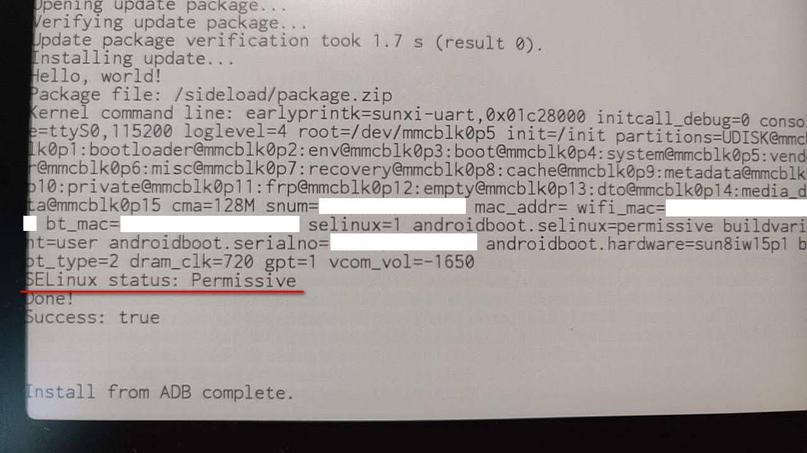

## The official boot image (for end users)

Warning: DO NOT use anything here if you don't know what you're doing! The device (Xiaomi Duokan Reader Pro) does not have a factory image provided by Xiaomi yet. Therefore, if you do anything wrong, you may leave your device in a bricked, non-restorable state.

If you understand everything above, this is the official `boot.img` of Xiaomi Duokan Reader **Pro**: [boot-virgo-perf1-1.1.8.210610.7z](https://github.com/Kazurin-775/duokan-rooter/releases/download/publish/boot-virgo-perf1-1.1.8.210610.7z)

- Device name: Xiaomi Duokan Reader **Pro**
- Codename (`ro.build.product`): `virgo-perf1`
- System version: MiReaderPro 1.1.8.210610
- Build fingerprint (`ro.build.fingerprint`): `Allwinner/virgo_perf1/virgo-perf1:8.1.0/OPM1.171019.026/20210610-121349:user/test-keys`

Since `fastboot boot` cannot work properly on this device, the above image is for TESTING PURPOSES only. For power users, it is strongly recommended to flash a modified image to `recovery` instead of `boot`. This is because the Android OS reflashes the official recovery image at every boot, and thus, restoring from a bad state is as easy as holding down the power button.

## What this project does

This project is for **Xiaomi Duokan Reader Pro**, whose recovery accepts `update.zip`s signed by a test key, allowing an end user to root the device with a crafted `update.zip`. For more information, consider reading [this](https://github.com/qwerty12/inkPalm-5-EPD105-root).

This project provides a flashable `update.zip` that creates and boots a **pwned recovery image** on-the-fly, which further removes the restrictions of the recovery. The new, pwned recovery has the following new features enabled:

- SELinux permissive
- ADB enabled &amp; rooted
- ADB authorization removed

This allows the user to do more powerful things, such as dumping the boot image to `/data/media`, without the restrictions of SELinux.

This project originally targets the Xiaomi Duokan Reader Pro, but it should work on most devices that allows the user to sideload a custom `update.zip`, with a small amount of modification.

## Example of a pwned recovery

## Special thanks to

- The [Magisk](https://github.com/topjohnwu/Magisk) installer by [topjohnwu](https://github.com/topjohnwu) and others, where all the ideas of this project come from
- [qwerty12](https://github.com/qwerty12) for his [great article on the rooting of the inkPalm 5](https://github.com/qwerty12/inkPalm-5-EPD105-root)

## Calling for help

If you have, or you know how to do any of the following things on this device, please inform me (via issues / discussions / etc.):

- Using `fastboot boot` to boot a custom boot image
- Entering recovery or bootloader from a power-off state
- Any official firmware image or guidance on debricking released by Xiaomi
